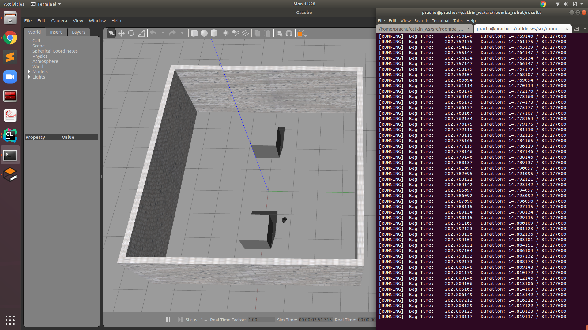
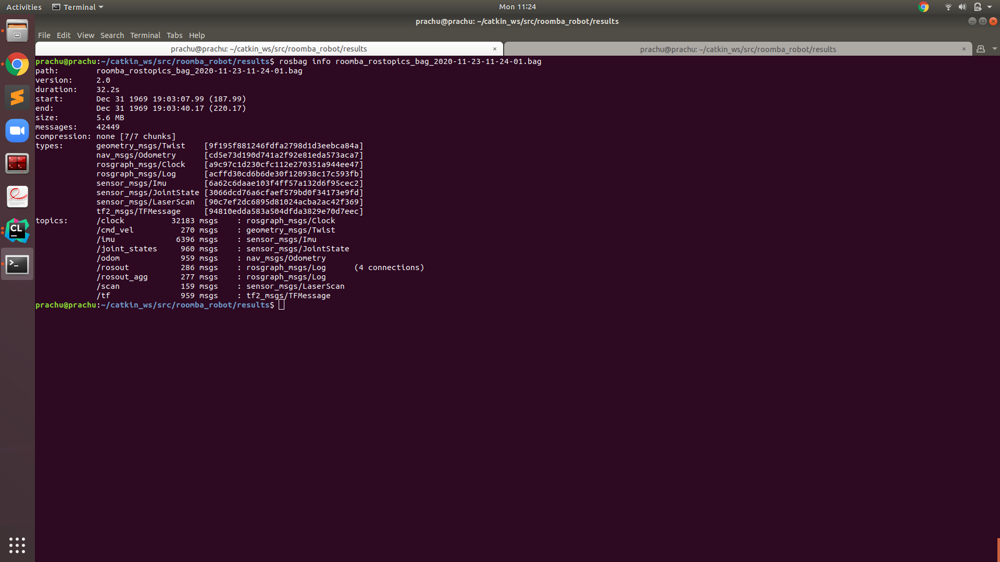

# roomba_robot

[](https://github.com/Pradeep-Gopal/beginner_tutorials/blob/master/LICENSE)

## Author

Pradeep Gopal

## Overview
This is a simulation of the famous vacuum cleaner robot in Gazebo using Turtlebot3 - burger, C++ and ROS

## Dependencies

ROS Melodic should be installed on your computer (preferably Ubuntu 18.04).
Catkin workspace must be set up.

## Set up and build

- Suppose your catkin workspace is 'catkin_ws' which has build, src and devel folders.
- Open new terminal and run the command 
```
git clone --recursive https://github.com/Pradeep-Gopal/roomba_robot

```
- Move the cloned folder to catkin_ws/src.
- Open terminal and run the following commands:
```
  cd ~/catkin_ws
  source ./devel/setup.bash
  catkin_make

```

## Setting the turtlebot3 model to burger

Open a new terminal and type the following
```
sudo gedit ~/.bashrc
```
Add the following line to the bashrc file

```
export TURTLEBOT3_MODEL=burger
```

Open a new terminal and type the following
```
source ~/.bashrc
```


## Steps to run the roomba robot without rosbag recording

Open a new terminal and type in the following command
```
roslaunch roomba_robot roomba.launch

```

Open another terminal and run the node using the following commands

```
  cd ~/catkin_ws
  source ./devel/setup.bash
  rosrun roomba_robot roomba_robot
```

## Steps to record and play a Rosbag file
ROSBag recording can be done using the following command-
Open a terminal to run the launch file: 
```
cd ~/catkin_ws
source ./devel/setup.bash
roslaunch roomba_robot roomba.launch rosBagEnable:=true
```
When the flag(default = false) is true, it will record until SIGINT(ctrl+c) is pressed.

Following are the steps to examine the recorded bag file
1. Open a terminal to launch the roomba robot in Gazebo: 
```
cd ~/catkin_ws
source ./devel/setup.bash
roslaunch roomba_robot roomba.launch
```

2. Open a new terminal to play the bag file:
```
cd ~/catkin_ws
source ./devel/setup.bash
cd src/roomba_robot/results
```

<p>Following image shows a demo of rosbag file being played</p>
<p align="center">

</p>

The info on rosbag file can be seen using the following command
```
cd ~/catkin_ws/src/beginner_tutorials/results
rosbag info roomba_rostopics_bag_2020-11-23-11-24-01.bag
```
<p>Following image shows the rosbag info</p>
<p align="center">

</p>


